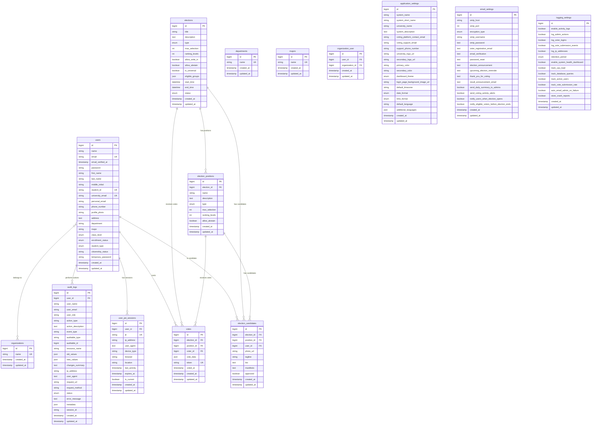

# 🗄️ Fisk Voting System - Complete Database Design

<div align="center">

**Comprehensive Database Design Documentation with ERD Diagrams**

[Overview](#-database-overview) • [ERD Diagrams](#-entity-relationship-diagrams) • [Table Structures](#-complete-table-structures) • [Relationships](#-entity-relationships) • [Indexes](#-indexes-and-performance)

</div>

---

## 📋 Table of Contents

1. [Database Overview](#-database-overview)
2. [Entity Relationship Diagrams](#-entity-relationship-diagrams)
3. [Complete Table Structures](#-complete-table-structures)
4. [Entity Relationships](#-entity-relationships)
5. [Indexes and Performance](#-indexes-and-performance)
6. [Constraints and Business Rules](#-constraints-and-business-rules)
7. [Data Types and Formats](#-data-types-and-formats)
8. [Sample Data Structures](#-sample-data-structures)
9. [Database Schema SQL](#-complete-database-schema-sql)

---

## 🎯 Database Overview

### Technology Stack
- **RDBMS**: MySQL 8.0+ / PostgreSQL 13+ / SQLite (development)
- **ORM**: Laravel Eloquent
- **Migration System**: Laravel Migrations (version-controlled)
- **Charset**: utf8mb4
- **Collation**: utf8mb4_unicode_ci (MySQL)

### Database Statistics
- **Total Tables**: 20+ core tables
- **Core Entity Tables**: 6
- **Supporting Tables**: 5
- **Pivot Tables**: 3
- **System Tables**: 6+
- **Third-Party Tables**: 5 (Spatie Permission, Media Library)

### Key Features
- ✅ Foreign key constraints enabled
- ✅ JSON column support for flexible data
- ✅ Comprehensive indexing for performance
- ✅ Audit logging for all critical operations
- ✅ Session management with JWT tracking
- ✅ Soft delete support (where applicable)

---

## 📊 Entity Relationship Diagrams

### ERD Format 1: PlantUML (Recommended)


### ERD Format 2: Mermaid



---

## 📋 Complete Table Structures

### 1. users

**Purpose**: Stores all system users (students, admins, staff)

**Complete Structure**:
```sql
CREATE TABLE users (
    id BIGINT UNSIGNED PRIMARY KEY AUTO_INCREMENT,
    
    -- Authentication
    name VARCHAR(255) NOT NULL,
    email VARCHAR(255) UNIQUE NOT NULL,
    email_verified_at TIMESTAMP NULL,
    password VARCHAR(255) NOT NULL,
    remember_token VARCHAR(100) NULL,
    
    -- Personal Information
    first_name VARCHAR(255) NULL,
    last_name VARCHAR(255) NULL,
    middle_initial VARCHAR(255) NULL COMMENT 'Supports full middle names',
    
    -- Student Information
    student_id VARCHAR(255) UNIQUE NULL,
    university_email VARCHAR(255) UNIQUE NULL,
    personal_email VARCHAR(255) NULL,
    phone_number VARCHAR(255) NULL,
    profile_photo VARCHAR(255) NULL,
    address TEXT NULL,
    
    -- Academic Information
    department VARCHAR(255) NULL,
    major VARCHAR(255) NULL,
    class_level ENUM('Freshman', 'Sophomore', 'Junior', 'Senior') NULL,
    
    -- Status Information
    enrollment_status ENUM('Active', 'Suspended', 'Graduated') DEFAULT 'Active',
    student_type ENUM('Undergraduate', 'Graduate', 'Transfer', 'International') NULL,
    citizenship_status VARCHAR(255) NULL,
    
    -- Password Management
    temporary_password VARCHAR(255) DEFAULT 'Fisk123',
    
    -- Timestamps
    created_at TIMESTAMP NULL,
    updated_at TIMESTAMP NULL,
    
    -- Indexes
    INDEX idx_email (email),
    INDEX idx_university_email (university_email),
    INDEX idx_student_id (student_id),
    INDEX idx_enrollment_status (enrollment_status)
) ENGINE=InnoDB DEFAULT CHARSET=utf8mb4 COLLATE=utf8mb4_unicode_ci;
```

**Key Fields**:
- `id`: Primary key
- `email`: Unique identifier for login
- `university_email`: University email (unique)
- `student_id`: Student ID (unique)
- `enrollment_status`: Current enrollment status

**Relationships**:
- `hasMany`: votes (as voter)
- `hasMany`: election_candidates (as candidate)
- `hasMany`: user_jwt_sessions
- `hasMany`: audit_logs
- `belongsToMany`: organizations (via organization_user)

---

### 2. elections

**Purpose**: Stores election records

**Complete Structure**:
```sql
CREATE TABLE elections (
    id BIGINT UNSIGNED PRIMARY KEY AUTO_INCREMENT,
    
    -- Basic Information
    title VARCHAR(255) NOT NULL,
    description TEXT NULL,
    
    -- Election Type
    type ENUM('single', 'multiple', 'referendum', 'ranked', 'poll') NOT NULL,
    
    -- Advanced Type Settings
    max_selection INT NULL COMMENT 'Used for multiple-choice elections',
    ranking_levels INT NULL COMMENT 'Used for ranked-choice elections',
    allow_write_in BOOLEAN DEFAULT FALSE,
    allow_abstain BOOLEAN DEFAULT FALSE,
    
    -- Eligibility Settings
    is_universal BOOLEAN DEFAULT FALSE COMMENT 'If TRUE, all students are eligible',
    eligible_groups JSON NULL COMMENT 'Contains departments[], class_levels[], organizations[], manual[]',
    
    -- Timeline
    start_time DATETIME NOT NULL,
    end_time DATETIME NOT NULL,
    
    -- Status
    status ENUM('draft', 'active', 'closed', 'archived') DEFAULT 'draft',
    
    -- Timestamps
    created_at TIMESTAMP NULL,
    updated_at TIMESTAMP NULL,
    
    -- Indexes
    INDEX idx_status (status),
    INDEX idx_start_time (start_time),
    INDEX idx_end_time (end_time),
    INDEX idx_type (type)
) ENGINE=InnoDB DEFAULT CHARSET=utf8mb4 COLLATE=utf8mb4_unicode_ci;
```

**Key Fields**:
- `type`: Election type (single, multiple, ranked, etc.)
- `eligible_groups`: JSON structure for eligibility rules
- `start_time` / `end_time`: Voting window
- `status`: Current election status

**Relationships**:
- `hasMany`: election_positions
- `hasMany`: election_candidates
- `hasMany`: votes

**Business Rules**:
- `start_time` must be before `end_time`
- `eligible_groups` JSON structure:
  ```json
  {
    "departments": [1, 2, 3],
    "class_levels": ["Freshman", "Sophomore"],
    "organizations": [5, 6],
    "manual": [100, 101, 102]
  }
  ```

---

### 3. election_positions

**Purpose**: Stores positions within elections

**Complete Structure**:
```sql
CREATE TABLE election_positions (
    id BIGINT UNSIGNED PRIMARY KEY AUTO_INCREMENT,
    election_id BIGINT UNSIGNED NOT NULL,
    
    -- Position Information
    name VARCHAR(255) NOT NULL,
    description TEXT NULL,
    
    -- Position Type
    type ENUM('single', 'multiple', 'ranked') DEFAULT 'single',
    max_selection INT NULL COMMENT 'Used for multiple-choice positions',
    ranking_levels INT NULL COMMENT 'Used for ranked-choice positions',
    allow_abstain BOOLEAN DEFAULT FALSE,
    
    -- Timestamps
    created_at TIMESTAMP NULL,
    updated_at TIMESTAMP NULL,
    
    -- Foreign Keys
    FOREIGN KEY (election_id) REFERENCES elections(id) ON DELETE CASCADE,
    
    -- Indexes
    INDEX idx_election_id (election_id),
    INDEX idx_type (type)
) ENGINE=InnoDB DEFAULT CHARSET=utf8mb4 COLLATE=utf8mb4_unicode_ci;
```

**Key Fields**:
- `election_id`: Foreign key to elections
- `type`: Position voting type
- `max_selection`: Maximum selections allowed (for multiple-choice)

**Relationships**:
- `belongsTo`: elections
- `hasMany`: election_candidates
- `hasMany`: votes

---

### 4. election_candidates

**Purpose**: Stores candidate information for positions

**Complete Structure**:
```sql
CREATE TABLE election_candidates (
    id BIGINT UNSIGNED PRIMARY KEY AUTO_INCREMENT,
    election_id BIGINT UNSIGNED NOT NULL,
    position_id BIGINT UNSIGNED NOT NULL,
    user_id BIGINT UNSIGNED NOT NULL,
    
    -- Candidate Information
    photo_url VARCHAR(255) NULL,
    tagline VARCHAR(255) NULL,
    bio TEXT NULL,
    manifesto TEXT NULL,
    approved BOOLEAN DEFAULT FALSE,
    
    -- Timestamps
    created_at TIMESTAMP NULL,
    updated_at TIMESTAMP NULL,
    
    -- Foreign Keys
    FOREIGN KEY (election_id) REFERENCES elections(id) ON DELETE CASCADE,
    FOREIGN KEY (position_id) REFERENCES election_positions(id) ON DELETE CASCADE,
    FOREIGN KEY (user_id) REFERENCES users(id) ON DELETE CASCADE,
    
    -- Unique Constraint
    UNIQUE KEY unique_candidate_per_position (election_id, position_id, user_id),
    
    -- Indexes
    INDEX idx_election_id (election_id),
    INDEX idx_position_id (position_id),
    INDEX idx_user_id (user_id),
    INDEX idx_approved (approved)
) ENGINE=InnoDB DEFAULT CHARSET=utf8mb4 COLLATE=utf8mb4_unicode_ci;
```

**Key Fields**:
- `election_id`, `position_id`, `user_id`: Composite foreign keys
- `approved`: Candidate approval status
- `manifesto`: Candidate platform/manifesto

**Relationships**:
- `belongsTo`: elections
- `belongsTo`: election_positions
- `belongsTo`: users

**Business Rules**:
- A user can only be a candidate once per position per election (unique constraint)
- `approved` must be `TRUE` for candidate to appear on ballot

---

### 5. votes

**Purpose**: Stores individual votes cast by users

**Complete Structure**:
```sql
CREATE TABLE votes (
    id BIGINT UNSIGNED PRIMARY KEY AUTO_INCREMENT,
    election_id BIGINT UNSIGNED NOT NULL,
    position_id BIGINT UNSIGNED NOT NULL,
    voter_id BIGINT UNSIGNED NOT NULL,
    
    -- Vote Data
    vote_data JSON NOT NULL COMMENT 'Core vote field - JSON for flexibility across all types',
    token VARCHAR(255) UNIQUE NOT NULL COMMENT 'Anonymized vote token for verification',
    voted_at TIMESTAMP NOT NULL,
    
    -- Timestamps
    created_at TIMESTAMP NULL,
    updated_at TIMESTAMP NULL,
    
    -- Foreign Keys
    FOREIGN KEY (election_id) REFERENCES elections(id) ON DELETE CASCADE,
    FOREIGN KEY (position_id) REFERENCES election_positions(id) ON DELETE CASCADE,
    FOREIGN KEY (voter_id) REFERENCES users(id) ON DELETE CASCADE,
    
    -- Unique Constraint
    UNIQUE KEY unique_vote_per_election (election_id, voter_id),
    
    -- Indexes
    INDEX idx_election_id (election_id),
    INDEX idx_position_id (position_id),
    INDEX idx_voter_id (voter_id),
    INDEX idx_voted_at (voted_at)
) ENGINE=InnoDB DEFAULT CHARSET=utf8mb4 COLLATE=utf8mb4_unicode_ci;
```

**Key Fields**:
- `vote_data`: JSON field storing vote information (varies by type)
- `token`: Unique anonymized token for vote verification
- `voted_at`: Timestamp when vote was cast

**Relationships**:
- `belongsTo`: elections
- `belongsTo`: election_positions
- `belongsTo`: users (as voter)

**Business Rules**:
- A voter can only cast **one vote per election** (unique constraint)
- `vote_data` JSON structure varies by position type:
  - **Single choice**: `{"candidate_id": 123}`
  - **Multiple choice**: `{"candidate_ids": [123, 456, 789]}`
  - **Ranked choice**: `{"rankings": [{"candidate_id": 123, "rank": 1}, {"candidate_id": 456, "rank": 2}]}`
  - **Write-in**: `{"write_in": "John Doe"}`
  - **Abstain**: `{"abstain": true}`
- Votes are **immutable** (no updates after creation)

---

### 6. audit_logs

**Purpose**: Comprehensive activity logging for security and transparency

**Complete Structure**:
```sql
CREATE TABLE audit_logs (
    id BIGINT UNSIGNED PRIMARY KEY AUTO_INCREMENT,
    
    -- User Information
    user_id BIGINT UNSIGNED NULL,
    user_name VARCHAR(255) NULL COMMENT 'User name snapshot at time of action',
    user_email VARCHAR(255) NULL COMMENT 'User email snapshot at time of action',
    user_role VARCHAR(255) NULL COMMENT 'User role at time of action',
    
    -- Action Details
    action_type VARCHAR(255) NOT NULL COMMENT 'Type of action (login, create, update, delete, etc.)',
    action_description TEXT NOT NULL COMMENT 'Human-readable description of the action',
    event_type VARCHAR(255) NULL COMMENT 'Technical event name (e.g., user.created)',
    
    -- Resource Information
    auditable_type VARCHAR(255) NULL COMMENT 'Model class name',
    auditable_id BIGINT UNSIGNED NULL COMMENT 'ID of the affected record',
    resource_name VARCHAR(255) NULL COMMENT 'Display name of the resource',
    
    -- Change Tracking
    old_values JSON NULL COMMENT 'Previous state (for updates)',
    new_values JSON NULL COMMENT 'New state (for creates/updates)',
    changes_summary TEXT NULL COMMENT 'Human-readable summary of changes',
    
    -- Request/Context Information
    ip_address VARCHAR(45) NULL COMMENT 'IP address (IPv4 or IPv6)',
    user_agent TEXT NULL COMMENT 'Browser/client information',
    request_url VARCHAR(255) NULL,
    request_method VARCHAR(10) NULL COMMENT 'HTTP method (GET, POST, etc.)',
    
    -- Status and Metadata
    status ENUM('success', 'failed', 'pending') DEFAULT 'success',
    error_message TEXT NULL COMMENT 'Error details if failed',
    metadata JSON NULL COMMENT 'Additional context data',
    session_id VARCHAR(255) NULL COMMENT 'Session identifier',
    
    -- Timestamps
    created_at TIMESTAMP NULL,
    updated_at TIMESTAMP NULL,
    
    -- Foreign Keys
    FOREIGN KEY (user_id) REFERENCES users(id) ON DELETE SET NULL,
    
    -- Indexes
    INDEX idx_user_id (user_id),
    INDEX idx_action_type (action_type),
    INDEX idx_event_type (event_type),
    INDEX idx_auditable (auditable_type, auditable_id),
    INDEX idx_ip_address (ip_address),
    INDEX idx_status (status),
    INDEX idx_session_id (session_id),
    INDEX idx_user_created (user_id, created_at),
    INDEX idx_action_created (action_type, created_at),
    INDEX idx_status_created (status, created_at)
) ENGINE=InnoDB DEFAULT CHARSET=utf8mb4 COLLATE=utf8mb4_unicode_ci;
```

**Key Fields**:
- `action_type`: Type of action performed
- `action_description`: Human-readable description
- `old_values` / `new_values`: JSON snapshots of changes
- `ip_address`: User's IP address
- `status`: Success/failure status

**Relationships**:
- `belongsTo`: users (nullable)

**Business Rules**:
- Logs are **immutable** (never updated, only created)
- `user_id` can be NULL for system actions
- `old_values` and `new_values` are JSON snapshots

---

### 7. user_jwt_sessions

**Purpose**: Tracks active JWT sessions for multi-device management

**Complete Structure**:
```sql
CREATE TABLE user_jwt_sessions (
    id BIGINT UNSIGNED PRIMARY KEY AUTO_INCREMENT,
    user_id BIGINT UNSIGNED NOT NULL,
    
    -- JWT Information
    jti VARCHAR(255) UNIQUE NOT NULL COMMENT 'JWT ID (jti claim) - unique token identifier',
    
    -- Device Information
    ip_address VARCHAR(45) NULL,
    user_agent TEXT NULL,
    device_type VARCHAR(255) NULL COMMENT 'e.g., iOS, Android, Windows, macOS, Linux',
    browser VARCHAR(255) NULL COMMENT 'e.g., Chrome, Firefox, Safari',
    location VARCHAR(255) NULL COMMENT 'Geographic location if available',
    
    -- Session Information
    last_activity TIMESTAMP DEFAULT CURRENT_TIMESTAMP,
    expires_at TIMESTAMP NULL COMMENT 'Token expiration time',
    is_current BOOLEAN DEFAULT FALSE COMMENT 'Is this the current session?',
    
    -- Timestamps
    created_at TIMESTAMP NULL,
    updated_at TIMESTAMP NULL,
    
    -- Foreign Keys
    FOREIGN KEY (user_id) REFERENCES users(id) ON DELETE CASCADE,
    
    -- Indexes
    INDEX idx_user_id (user_id),
    INDEX idx_jti (jti),
    INDEX idx_user_current (user_id, is_current),
    INDEX idx_user_activity (user_id, last_activity),
    INDEX idx_expires_at (expires_at)
) ENGINE=InnoDB DEFAULT CHARSET=utf8mb4 COLLATE=utf8mb4_unicode_ci;
```

**Key Fields**:
- `jti`: JWT ID (unique token identifier)
- `device_type` / `browser`: Device information
- `is_current`: Marks the current active session
- `expires_at`: Token expiration timestamp

**Relationships**:
- `belongsTo`: users

**Business Rules**:
- Only one session per user can have `is_current = TRUE`
- Expired sessions should be cleaned up periodically

---

### 8. departments

**Purpose**: Stores academic departments

**Complete Structure**:
```sql
CREATE TABLE departments (
    id BIGINT UNSIGNED PRIMARY KEY AUTO_INCREMENT,
    name VARCHAR(255) UNIQUE NOT NULL,
    created_at TIMESTAMP NULL,
    updated_at TIMESTAMP NULL
) ENGINE=InnoDB DEFAULT CHARSET=utf8mb4 COLLATE=utf8mb4_unicode_ci;
```

---

### 9. majors

**Purpose**: Stores academic majors

**Complete Structure**:
```sql
CREATE TABLE majors (
    id BIGINT UNSIGNED PRIMARY KEY AUTO_INCREMENT,
    name VARCHAR(255) UNIQUE NOT NULL,
    created_at TIMESTAMP NULL,
    updated_at TIMESTAMP NULL
) ENGINE=InnoDB DEFAULT CHARSET=utf8mb4 COLLATE=utf8mb4_unicode_ci;
```

---

### 10. organizations

**Purpose**: Stores student organizations

**Complete Structure**:
```sql
CREATE TABLE organizations (
    id BIGINT UNSIGNED PRIMARY KEY AUTO_INCREMENT,
    name VARCHAR(255) UNIQUE NOT NULL,
    created_at TIMESTAMP NULL,
    updated_at TIMESTAMP NULL
) ENGINE=InnoDB DEFAULT CHARSET=utf8mb4 COLLATE=utf8mb4_unicode_ci;
```

---

### 11. organization_user (Pivot Table)

**Purpose**: Many-to-many relationship between users and organizations

**Complete Structure**:
```sql
CREATE TABLE organization_user (
    id BIGINT UNSIGNED PRIMARY KEY AUTO_INCREMENT,
    user_id BIGINT UNSIGNED NOT NULL,
    organization_id BIGINT UNSIGNED NOT NULL,
    created_at TIMESTAMP NULL,
    updated_at TIMESTAMP NULL,
    
    -- Foreign Keys
    FOREIGN KEY (user_id) REFERENCES users(id) ON DELETE CASCADE,
    FOREIGN KEY (organization_id) REFERENCES organizations(id) ON DELETE CASCADE,
    
    -- Unique Constraint
    UNIQUE KEY unique_user_organization (user_id, organization_id),
    
    -- Indexes
    INDEX idx_user_id (user_id),
    INDEX idx_organization_id (organization_id)
) ENGINE=InnoDB DEFAULT CHARSET=utf8mb4 COLLATE=utf8mb4_unicode_ci;
```

---

### 12. application_settings

**Purpose**: System-wide application configuration

**Complete Structure**:
```sql
CREATE TABLE application_settings (
    id BIGINT UNSIGNED PRIMARY KEY AUTO_INCREMENT,
    
    -- Platform Identity
    system_name VARCHAR(255) DEFAULT 'Fisk Voting System',
    system_short_name VARCHAR(255) DEFAULT 'FVS',
    university_name VARCHAR(255) DEFAULT 'Fisk University',
    system_description TEXT NULL,
    voting_platform_contact_email VARCHAR(255) NULL,
    voting_support_email VARCHAR(255) NULL,
    support_phone_number VARCHAR(255) NULL,
    
    -- Branding
    university_logo_url VARCHAR(255) NULL,
    secondary_logo_url VARCHAR(255) NULL,
    primary_color VARCHAR(255) DEFAULT '#3B82F6',
    secondary_color VARCHAR(255) DEFAULT '#8B5CF6',
    dashboard_theme ENUM('light', 'dark', 'auto') DEFAULT 'auto',
    login_page_background_image_url VARCHAR(255) NULL,
    
    -- Time & Localization
    default_timezone VARCHAR(255) DEFAULT 'America/Chicago',
    date_format ENUM('MM/DD/YYYY', 'DD/MM/YYYY', 'YYYY-MM-DD') DEFAULT 'MM/DD/YYYY',
    time_format ENUM('12-hour', '24-hour') DEFAULT '12-hour',
    default_language VARCHAR(255) DEFAULT 'en',
    additional_languages JSON NULL,
    
    created_at TIMESTAMP NULL,
    updated_at TIMESTAMP NULL
) ENGINE=InnoDB DEFAULT CHARSET=utf8mb4 COLLATE=utf8mb4_unicode_ci;
```

---

### 13. email_settings

**Purpose**: Email server and template configuration

**Complete Structure**:
```sql
CREATE TABLE email_settings (
    id BIGINT UNSIGNED PRIMARY KEY AUTO_INCREMENT,
    
    -- Email Server Settings
    smtp_host VARCHAR(255) NULL,
    smtp_port INT DEFAULT 587,
    encryption_type ENUM('tls', 'ssl', 'none') DEFAULT 'tls',
    smtp_username VARCHAR(255) NULL,
    smtp_password TEXT NULL COMMENT 'Encrypted',
    
    -- Email Templates (JSON)
    voter_registration_email TEXT NULL,
    email_verification TEXT NULL,
    password_reset TEXT NULL,
    election_announcement TEXT NULL,
    upcoming_election_reminder TEXT NULL,
    thank_you_for_voting TEXT NULL,
    result_announcement_email TEXT NULL,
    
    -- Notification Preferences
    send_daily_summary_to_admins BOOLEAN DEFAULT FALSE,
    send_voting_activity_alerts BOOLEAN DEFAULT FALSE,
    notify_users_when_election_opens BOOLEAN DEFAULT TRUE,
    notify_eligible_voters_before_election_ends BOOLEAN DEFAULT TRUE,
    
    created_at TIMESTAMP NULL,
    updated_at TIMESTAMP NULL
) ENGINE=InnoDB DEFAULT CHARSET=utf8mb4 COLLATE=utf8mb4_unicode_ci;
```

---

### 14. logging_settings

**Purpose**: Logging and monitoring configuration

**Complete Structure**:
```sql
CREATE TABLE logging_settings (
    id BIGINT UNSIGNED PRIMARY KEY AUTO_INCREMENT,
    
    -- Logging Preferences
    enable_activity_logs BOOLEAN DEFAULT TRUE,
    log_admin_actions BOOLEAN DEFAULT TRUE,
    log_voter_logins BOOLEAN DEFAULT TRUE,
    log_vote_submission_events BOOLEAN DEFAULT TRUE COMMENT 'Vote submission events should be anonymized before storage',
    log_ip_addresses BOOLEAN DEFAULT FALSE COMMENT 'When enabled, IPs must be stored securely and in compliance with privacy policies',
    
    -- Log Retention
    retention_period ENUM('30_days', '3_months', '1_year', 'forever') DEFAULT '3_months',
    
    -- Performance Monitoring
    enable_system_health_dashboard BOOLEAN DEFAULT TRUE,
    track_cpu_load BOOLEAN DEFAULT TRUE,
    track_database_queries BOOLEAN DEFAULT TRUE,
    track_active_users BOOLEAN DEFAULT TRUE,
    track_vote_submission_rate BOOLEAN DEFAULT TRUE,
    
    -- Error & Crash Handling
    auto_email_admin_on_failure BOOLEAN DEFAULT TRUE,
    store_crash_reports BOOLEAN DEFAULT TRUE,
    
    created_at TIMESTAMP NULL,
    updated_at TIMESTAMP NULL
) ENGINE=InnoDB DEFAULT CHARSET=utf8mb4 COLLATE=utf8mb4_unicode_ci;
```

---

## 🔗 Entity Relationships

### Relationship Summary

```
users
├── hasMany → votes (as voter)
├── hasMany → election_candidates (as candidate)
├── hasMany → user_jwt_sessions
├── hasMany → audit_logs
└── belongsToMany → organizations (via organization_user)

elections
├── hasMany → election_positions
├── hasMany → election_candidates
└── hasMany → votes

election_positions
├── belongsTo → elections
├── hasMany → election_candidates
└── hasMany → votes

election_candidates
├── belongsTo → elections
├── belongsTo → election_positions
└── belongsTo → users

votes
├── belongsTo → elections
├── belongsTo → election_positions
└── belongsTo → users (as voter)

organizations
└── belongsToMany → users (via organization_user)

audit_logs
└── belongsTo → users (nullable)
```

### Relationship Details

#### One-to-Many Relationships

1. **users → votes** (1:N)
   - One user can cast multiple votes (across different elections)
   - Foreign key: `votes.voter_id` → `users.id`
   - Cascade delete: Yes

2. **elections → election_positions** (1:N)
   - One election can have multiple positions
   - Foreign key: `election_positions.election_id` → `elections.id`
   - Cascade delete: Yes

3. **elections → votes** (1:N)
   - One election can receive multiple votes
   - Foreign key: `votes.election_id` → `elections.id`
   - Cascade delete: Yes

4. **election_positions → election_candidates** (1:N)
   - One position can have multiple candidates
   - Foreign key: `election_candidates.position_id` → `election_positions.id`
   - Cascade delete: Yes

5. **users → election_candidates** (1:N)
   - One user can be a candidate in multiple positions/elections
   - Foreign key: `election_candidates.user_id` → `users.id`
   - Cascade delete: Yes

6. **users → user_jwt_sessions** (1:N)
   - One user can have multiple active sessions
   - Foreign key: `user_jwt_sessions.user_id` → `users.id`
   - Cascade delete: Yes

7. **users → audit_logs** (1:N)
   - One user can have multiple audit log entries
   - Foreign key: `audit_logs.user_id` → `users.id`
   - Set null on delete: Yes (preserve logs even if user deleted)

#### Many-to-Many Relationships

1. **users ↔ organizations** (N:M)
   - Many users can belong to many organizations
   - Pivot table: `organization_user`
   - Foreign keys:
     - `organization_user.user_id` → `users.id`
     - `organization_user.organization_id` → `organizations.id`
   - Unique constraint: `(user_id, organization_id)`

---

## 📊 Indexes and Performance

### Primary Indexes

All tables have a primary key index on `id`:
- `PRIMARY KEY (id)`

### Foreign Key Indexes

All foreign keys are automatically indexed:
- `election_positions.election_id`
- `election_candidates.election_id`, `position_id`, `user_id`
- `votes.election_id`, `position_id`, `voter_id`
- `user_jwt_sessions.user_id`
- `audit_logs.user_id`
- `organization_user.user_id`, `organization_id`

### Unique Indexes

1. **users**:
   - `UNIQUE (email)`
   - `UNIQUE (university_email)`
   - `UNIQUE (student_id)`

2. **election_candidates**:
   - `UNIQUE (election_id, position_id, user_id)`

3. **votes**:
   - `UNIQUE (election_id, voter_id)`
   - `UNIQUE (token)`

4. **user_jwt_sessions**:
   - `UNIQUE (jti)`

5. **organization_user**:
   - `UNIQUE (user_id, organization_id)`

6. **departments**, **majors**, **organizations**:
   - `UNIQUE (name)`

### Composite Indexes

1. **audit_logs**:
   - `INDEX (user_id, created_at)` - For user activity queries
   - `INDEX (action_type, created_at)` - For action type queries
   - `INDEX (status, created_at)` - For status filtering
   - `INDEX (auditable_type, auditable_id)` - For polymorphic queries

2. **user_jwt_sessions**:
   - `INDEX (user_id, last_activity)` - For session activity queries
   - `INDEX (user_id, is_current)` - For current session queries

3. **votes**:
   - `INDEX (election_id, voter_id)` - For vote lookup
   - `INDEX (voted_at)` - For chronological queries

### Performance Considerations

1. **JSON Columns**: 
   - `elections.eligible_groups` - Indexed via generated columns (if needed)
   - `votes.vote_data` - Queried via JSON functions

2. **Timestamp Indexes**:
   - `created_at` / `updated_at` - Indexed for sorting and filtering

3. **Status Indexes**:
   - `elections.status` - Frequently filtered
   - `users.enrollment_status` - For eligibility checks

---

## 🔒 Constraints and Business Rules

### Foreign Key Constraints

All foreign keys use `ON DELETE CASCADE` except:
- `audit_logs.user_id` → `ON DELETE SET NULL` (preserve logs)

### Unique Constraints

1. **One vote per election per voter**: `UNIQUE (election_id, voter_id)`
2. **One candidate per position per election**: `UNIQUE (election_id, position_id, user_id)`
3. **Unique email addresses**: `UNIQUE (email)`, `UNIQUE (university_email)`
4. **Unique student ID**: `UNIQUE (student_id)`
5. **Unique JWT token**: `UNIQUE (jti)`

### Check Constraints (Application-Level)

1. **Election Timeline**: `start_time < end_time`
2. **Vote Data Validation**: JSON structure must match position type
3. **Eligibility**: User must meet `eligible_groups` criteria
4. **Approval**: Candidate must be approved to appear on ballot

### Data Integrity Rules

1. **Votes are Immutable**: Once created, votes cannot be updated
2. **Audit Logs are Immutable**: Logs are never updated, only created
3. **Cascade Deletes**: Deleting an election deletes all related positions, candidates, and votes
4. **Soft Deletes**: Not currently implemented, but can be added

---

## 📝 Data Types and Formats

### JSON Structures

#### 1. `elections.eligible_groups`
```json
{
  "departments": [1, 2, 3],
  "class_levels": ["Freshman", "Sophomore", "Junior", "Senior"],
  "organizations": [5, 6, 7],
  "manual": [100, 101, 102]
}
```

#### 2. `votes.vote_data` - Single Choice
```json
{
  "candidate_id": 123
}
```

#### 3. `votes.vote_data` - Multiple Choice
```json
{
  "candidate_ids": [123, 456, 789]
}
```

#### 4. `votes.vote_data` - Ranked Choice
```json
{
  "rankings": [
    {"candidate_id": 123, "rank": 1},
    {"candidate_id": 456, "rank": 2},
    {"candidate_id": 789, "rank": 3}
  ]
}
```

#### 5. `votes.vote_data` - Write-in
```json
{
  "write_in": "John Doe"
}
```

#### 6. `votes.vote_data` - Abstain
```json
{
  "abstain": true
}
```

#### 7. `audit_logs.old_values` / `new_values`
```json
{
  "name": "John Doe",
  "email": "john@example.com",
  "status": "active"
}
```

#### 8. `audit_logs.metadata`
```json
{
  "route": "api.v1.students.login",
  "path": "/api/v1/students/login",
  "method": "POST"
}
```

#### 9. `application_settings.additional_languages`
```json
["es", "fr", "de"]
```

---

## 💾 Sample Data Structures

### Sample User Record
```json
{
  "id": 1,
  "name": "John Doe",
  "email": "john.doe@fisk.edu",
  "email_verified_at": "2024-01-15 10:30:00",
  "first_name": "John",
  "last_name": "Doe",
  "middle_initial": "M",
  "student_id": "FISK2024001",
  "university_email": "john.doe@fisk.edu",
  "department": "Computer Science",
  "major": "Computer Science",
  "class_level": "Junior",
  "enrollment_status": "Active",
  "student_type": "Undergraduate"
}
```

### Sample Election Record
```json
{
  "id": 1,
  "title": "Student Government Election 2024",
  "description": "Annual election for student government positions",
  "type": "ranked",
  "ranking_levels": 3,
  "is_universal": true,
  "start_time": "2024-03-01 08:00:00",
  "end_time": "2024-03-05 17:00:00",
  "status": "active"
}
```

### Sample Vote Record (Ranked Choice)
```json
{
  "id": 1,
  "election_id": 1,
  "position_id": 1,
  "voter_id": 1,
  "vote_data": {
    "rankings": [
      {"candidate_id": 5, "rank": 1},
      {"candidate_id": 3, "rank": 2},
      {"candidate_id": 7, "rank": 3}
    ]
  },
  "token": "a1b2c3d4e5f6g7h8i9j0",
  "voted_at": "2024-03-02 14:30:00"
}
```

---

## 🗃️ Complete Database Schema SQL

### Full SQL DDL Script

```sql
-- ============================================
-- Fisk Voting System - Complete Database Schema
-- ============================================

SET FOREIGN_KEY_CHECKS = 0;
SET SQL_MODE = "NO_AUTO_VALUE_ON_ZERO";
SET AUTOCOMMIT = 0;
START TRANSACTION;
SET time_zone = "+00:00";

-- ============================================
-- Core Tables
-- ============================================

-- Users Table
CREATE TABLE `users` (
  `id` BIGINT UNSIGNED NOT NULL AUTO_INCREMENT,
  `name` VARCHAR(255) NOT NULL,
  `email` VARCHAR(255) NOT NULL,
  `email_verified_at` TIMESTAMP NULL DEFAULT NULL,
  `password` VARCHAR(255) NOT NULL,
  `remember_token` VARCHAR(100) DEFAULT NULL,
  `first_name` VARCHAR(255) DEFAULT NULL,
  `last_name` VARCHAR(255) DEFAULT NULL,
  `middle_initial` VARCHAR(255) DEFAULT NULL,
  `student_id` VARCHAR(255) DEFAULT NULL,
  `university_email` VARCHAR(255) DEFAULT NULL,
  `personal_email` VARCHAR(255) DEFAULT NULL,
  `phone_number` VARCHAR(255) DEFAULT NULL,
  `profile_photo` VARCHAR(255) DEFAULT NULL,
  `address` TEXT DEFAULT NULL,
  `department` VARCHAR(255) DEFAULT NULL,
  `major` VARCHAR(255) DEFAULT NULL,
  `class_level` ENUM('Freshman', 'Sophomore', 'Junior', 'Senior') DEFAULT NULL,
  `enrollment_status` ENUM('Active', 'Suspended', 'Graduated') DEFAULT 'Active',
  `student_type` ENUM('Undergraduate', 'Graduate', 'Transfer', 'International') DEFAULT NULL,
  `citizenship_status` VARCHAR(255) DEFAULT NULL,
  `temporary_password` VARCHAR(255) DEFAULT 'Fisk123',
  `created_at` TIMESTAMP NULL DEFAULT NULL,
  `updated_at` TIMESTAMP NULL DEFAULT NULL,
  PRIMARY KEY (`id`),
  UNIQUE KEY `users_email_unique` (`email`),
  UNIQUE KEY `users_university_email_unique` (`university_email`),
  UNIQUE KEY `users_student_id_unique` (`student_id`),
  KEY `idx_enrollment_status` (`enrollment_status`)
) ENGINE=InnoDB DEFAULT CHARSET=utf8mb4 COLLATE=utf8mb4_unicode_ci;

-- Elections Table
CREATE TABLE `elections` (
  `id` BIGINT UNSIGNED NOT NULL AUTO_INCREMENT,
  `title` VARCHAR(255) NOT NULL,
  `description` TEXT DEFAULT NULL,
  `type` ENUM('single', 'multiple', 'referendum', 'ranked', 'poll') NOT NULL,
  `max_selection` INT DEFAULT NULL,
  `ranking_levels` INT DEFAULT NULL,
  `allow_write_in` BOOLEAN DEFAULT FALSE,
  `allow_abstain` BOOLEAN DEFAULT FALSE,
  `is_universal` BOOLEAN DEFAULT FALSE,
  `eligible_groups` JSON DEFAULT NULL,
  `start_time` DATETIME NOT NULL,
  `end_time` DATETIME NOT NULL,
  `status` ENUM('draft', 'active', 'closed', 'archived') DEFAULT 'draft',
  `created_at` TIMESTAMP NULL DEFAULT NULL,
  `updated_at` TIMESTAMP NULL DEFAULT NULL,
  PRIMARY KEY (`id`),
  KEY `idx_status` (`status`),
  KEY `idx_start_time` (`start_time`),
  KEY `idx_end_time` (`end_time`)
) ENGINE=InnoDB DEFAULT CHARSET=utf8mb4 COLLATE=utf8mb4_unicode_ci;

-- Election Positions Table
CREATE TABLE `election_positions` (
  `id` BIGINT UNSIGNED NOT NULL AUTO_INCREMENT,
  `election_id` BIGINT UNSIGNED NOT NULL,
  `name` VARCHAR(255) NOT NULL,
  `description` TEXT DEFAULT NULL,
  `type` ENUM('single', 'multiple', 'ranked') DEFAULT 'single',
  `max_selection` INT DEFAULT NULL,
  `ranking_levels` INT DEFAULT NULL,
  `allow_abstain` BOOLEAN DEFAULT FALSE,
  `created_at` TIMESTAMP NULL DEFAULT NULL,
  `updated_at` TIMESTAMP NULL DEFAULT NULL,
  PRIMARY KEY (`id`),
  KEY `election_positions_election_id_foreign` (`election_id`),
  CONSTRAINT `election_positions_election_id_foreign` FOREIGN KEY (`election_id`) REFERENCES `elections` (`id`) ON DELETE CASCADE
) ENGINE=InnoDB DEFAULT CHARSET=utf8mb4 COLLATE=utf8mb4_unicode_ci;

-- Election Candidates Table
CREATE TABLE `election_candidates` (
  `id` BIGINT UNSIGNED NOT NULL AUTO_INCREMENT,
  `election_id` BIGINT UNSIGNED NOT NULL,
  `position_id` BIGINT UNSIGNED NOT NULL,
  `user_id` BIGINT UNSIGNED NOT NULL,
  `photo_url` VARCHAR(255) DEFAULT NULL,
  `tagline` VARCHAR(255) DEFAULT NULL,
  `bio` TEXT DEFAULT NULL,
  `manifesto` TEXT DEFAULT NULL,
  `approved` BOOLEAN DEFAULT FALSE,
  `created_at` TIMESTAMP NULL DEFAULT NULL,
  `updated_at` TIMESTAMP NULL DEFAULT NULL,
  PRIMARY KEY (`id`),
  UNIQUE KEY `unique_candidate_per_position` (`election_id`, `position_id`, `user_id`),
  KEY `election_candidates_election_id_foreign` (`election_id`),
  KEY `election_candidates_position_id_foreign` (`position_id`),
  KEY `election_candidates_user_id_foreign` (`user_id`),
  CONSTRAINT `election_candidates_election_id_foreign` FOREIGN KEY (`election_id`) REFERENCES `elections` (`id`) ON DELETE CASCADE,
  CONSTRAINT `election_candidates_position_id_foreign` FOREIGN KEY (`position_id`) REFERENCES `election_positions` (`id`) ON DELETE CASCADE,
  CONSTRAINT `election_candidates_user_id_foreign` FOREIGN KEY (`user_id`) REFERENCES `users` (`id`) ON DELETE CASCADE
) ENGINE=InnoDB DEFAULT CHARSET=utf8mb4 COLLATE=utf8mb4_unicode_ci;

-- Votes Table
CREATE TABLE `votes` (
  `id` BIGINT UNSIGNED NOT NULL AUTO_INCREMENT,
  `election_id` BIGINT UNSIGNED NOT NULL,
  `position_id` BIGINT UNSIGNED NOT NULL,
  `voter_id` BIGINT UNSIGNED NOT NULL,
  `vote_data` JSON NOT NULL,
  `token` VARCHAR(255) NOT NULL,
  `voted_at` TIMESTAMP NOT NULL,
  `created_at` TIMESTAMP NULL DEFAULT NULL,
  `updated_at` TIMESTAMP NULL DEFAULT NULL,
  PRIMARY KEY (`id`),
  UNIQUE KEY `unique_vote_per_election` (`election_id`, `voter_id`),
  UNIQUE KEY `votes_token_unique` (`token`),
  KEY `votes_election_id_foreign` (`election_id`),
  KEY `votes_position_id_foreign` (`position_id`),
  KEY `votes_voter_id_foreign` (`voter_id`),
  KEY `idx_voted_at` (`voted_at`),
  CONSTRAINT `votes_election_id_foreign` FOREIGN KEY (`election_id`) REFERENCES `elections` (`id`) ON DELETE CASCADE,
  CONSTRAINT `votes_position_id_foreign` FOREIGN KEY (`position_id`) REFERENCES `election_positions` (`id`) ON DELETE CASCADE,
  CONSTRAINT `votes_voter_id_foreign` FOREIGN KEY (`voter_id`) REFERENCES `users` (`id`) ON DELETE CASCADE
) ENGINE=InnoDB DEFAULT CHARSET=utf8mb4 COLLATE=utf8mb4_unicode_ci;

-- Audit Logs Table
CREATE TABLE `audit_logs` (
  `id` BIGINT UNSIGNED NOT NULL AUTO_INCREMENT,
  `user_id` BIGINT UNSIGNED DEFAULT NULL,
  `user_name` VARCHAR(255) DEFAULT NULL,
  `user_email` VARCHAR(255) DEFAULT NULL,
  `user_role` VARCHAR(255) DEFAULT NULL,
  `action_type` VARCHAR(255) NOT NULL,
  `action_description` TEXT NOT NULL,
  `event_type` VARCHAR(255) DEFAULT NULL,
  `auditable_type` VARCHAR(255) DEFAULT NULL,
  `auditable_id` BIGINT UNSIGNED DEFAULT NULL,
  `resource_name` VARCHAR(255) DEFAULT NULL,
  `old_values` JSON DEFAULT NULL,
  `new_values` JSON DEFAULT NULL,
  `changes_summary` TEXT DEFAULT NULL,
  `ip_address` VARCHAR(45) DEFAULT NULL,
  `user_agent` TEXT DEFAULT NULL,
  `request_url` VARCHAR(255) DEFAULT NULL,
  `request_method` VARCHAR(10) DEFAULT NULL,
  `status` ENUM('success', 'failed', 'pending') DEFAULT 'success',
  `error_message` TEXT DEFAULT NULL,
  `metadata` JSON DEFAULT NULL,
  `session_id` VARCHAR(255) DEFAULT NULL,
  `created_at` TIMESTAMP NULL DEFAULT NULL,
  `updated_at` TIMESTAMP NULL DEFAULT NULL,
  PRIMARY KEY (`id`),
  KEY `audit_logs_user_id_foreign` (`user_id`),
  KEY `idx_action_type` (`action_type`),
  KEY `idx_event_type` (`event_type`),
  KEY `idx_auditable` (`auditable_type`, `auditable_id`),
  KEY `idx_ip_address` (`ip_address`),
  KEY `idx_status` (`status`),
  KEY `idx_session_id` (`session_id`),
  KEY `idx_user_created` (`user_id`, `created_at`),
  KEY `idx_action_created` (`action_type`, `created_at`),
  KEY `idx_status_created` (`status`, `created_at`),
  CONSTRAINT `audit_logs_user_id_foreign` FOREIGN KEY (`user_id`) REFERENCES `users` (`id`) ON DELETE SET NULL
) ENGINE=InnoDB DEFAULT CHARSET=utf8mb4 COLLATE=utf8mb4_unicode_ci;

-- User JWT Sessions Table
CREATE TABLE `user_jwt_sessions` (
  `id` BIGINT UNSIGNED NOT NULL AUTO_INCREMENT,
  `user_id` BIGINT UNSIGNED NOT NULL,
  `jti` VARCHAR(255) NOT NULL,
  `ip_address` VARCHAR(45) DEFAULT NULL,
  `user_agent` TEXT DEFAULT NULL,
  `device_type` VARCHAR(255) DEFAULT NULL,
  `browser` VARCHAR(255) DEFAULT NULL,
  `location` VARCHAR(255) DEFAULT NULL,
  `last_activity` TIMESTAMP DEFAULT CURRENT_TIMESTAMP,
  `expires_at` TIMESTAMP DEFAULT NULL,
  `is_current` BOOLEAN DEFAULT FALSE,
  `created_at` TIMESTAMP NULL DEFAULT NULL,
  `updated_at` TIMESTAMP NULL DEFAULT NULL,
  PRIMARY KEY (`id`),
  UNIQUE KEY `user_jwt_sessions_jti_unique` (`jti`),
  KEY `user_jwt_sessions_user_id_foreign` (`user_id`),
  KEY `idx_user_current` (`user_id`, `is_current`),
  KEY `idx_user_activity` (`user_id`, `last_activity`),
  KEY `idx_expires_at` (`expires_at`),
  CONSTRAINT `user_jwt_sessions_user_id_foreign` FOREIGN KEY (`user_id`) REFERENCES `users` (`id`) ON DELETE CASCADE
) ENGINE=InnoDB DEFAULT CHARSET=utf8mb4 COLLATE=utf8mb4_unicode_ci;

-- ============================================
-- Supporting Tables
-- ============================================

-- Departments Table
CREATE TABLE `departments` (
  `id` BIGINT UNSIGNED NOT NULL AUTO_INCREMENT,
  `name` VARCHAR(255) NOT NULL,
  `created_at` TIMESTAMP NULL DEFAULT NULL,
  `updated_at` TIMESTAMP NULL DEFAULT NULL,
  PRIMARY KEY (`id`),
  UNIQUE KEY `departments_name_unique` (`name`)
) ENGINE=InnoDB DEFAULT CHARSET=utf8mb4 COLLATE=utf8mb4_unicode_ci;

-- Majors Table
CREATE TABLE `majors` (
  `id` BIGINT UNSIGNED NOT NULL AUTO_INCREMENT,
  `name` VARCHAR(255) NOT NULL,
  `created_at` TIMESTAMP NULL DEFAULT NULL,
  `updated_at` TIMESTAMP NULL DEFAULT NULL,
  PRIMARY KEY (`id`),
  UNIQUE KEY `majors_name_unique` (`name`)
) ENGINE=InnoDB DEFAULT CHARSET=utf8mb4 COLLATE=utf8mb4_unicode_ci;

-- Organizations Table
CREATE TABLE `organizations` (
  `id` BIGINT UNSIGNED NOT NULL AUTO_INCREMENT,
  `name` VARCHAR(255) NOT NULL,
  `created_at` TIMESTAMP NULL DEFAULT NULL,
  `updated_at` TIMESTAMP NULL DEFAULT NULL,
  PRIMARY KEY (`id`),
  UNIQUE KEY `organizations_name_unique` (`name`)
) ENGINE=InnoDB DEFAULT CHARSET=utf8mb4 COLLATE=utf8mb4_unicode_ci;

-- Organization User Pivot Table
CREATE TABLE `organization_user` (
  `id` BIGINT UNSIGNED NOT NULL AUTO_INCREMENT,
  `user_id` BIGINT UNSIGNED NOT NULL,
  `organization_id` BIGINT UNSIGNED NOT NULL,
  `created_at` TIMESTAMP NULL DEFAULT NULL,
  `updated_at` TIMESTAMP NULL DEFAULT NULL,
  PRIMARY KEY (`id`),
  UNIQUE KEY `unique_user_organization` (`user_id`, `organization_id`),
  KEY `organization_user_user_id_foreign` (`user_id`),
  KEY `organization_user_organization_id_foreign` (`organization_id`),
  CONSTRAINT `organization_user_user_id_foreign` FOREIGN KEY (`user_id`) REFERENCES `users` (`id`) ON DELETE CASCADE,
  CONSTRAINT `organization_user_organization_id_foreign` FOREIGN KEY (`organization_id`) REFERENCES `organizations` (`id`) ON DELETE CASCADE
) ENGINE=InnoDB DEFAULT CHARSET=utf8mb4 COLLATE=utf8mb4_unicode_ci;

-- Application Settings Table
CREATE TABLE `application_settings` (
  `id` BIGINT UNSIGNED NOT NULL AUTO_INCREMENT,
  `system_name` VARCHAR(255) DEFAULT 'Fisk Voting System',
  `system_short_name` VARCHAR(255) DEFAULT 'FVS',
  `university_name` VARCHAR(255) DEFAULT 'Fisk University',
  `system_description` TEXT DEFAULT NULL,
  `voting_platform_contact_email` VARCHAR(255) DEFAULT NULL,
  `voting_support_email` VARCHAR(255) DEFAULT NULL,
  `support_phone_number` VARCHAR(255) DEFAULT NULL,
  `university_logo_url` VARCHAR(255) DEFAULT NULL,
  `secondary_logo_url` VARCHAR(255) DEFAULT NULL,
  `primary_color` VARCHAR(255) DEFAULT '#3B82F6',
  `secondary_color` VARCHAR(255) DEFAULT '#8B5CF6',
  `dashboard_theme` ENUM('light', 'dark', 'auto') DEFAULT 'auto',
  `login_page_background_image_url` VARCHAR(255) DEFAULT NULL,
  `default_timezone` VARCHAR(255) DEFAULT 'America/Chicago',
  `date_format` ENUM('MM/DD/YYYY', 'DD/MM/YYYY', 'YYYY-MM-DD') DEFAULT 'MM/DD/YYYY',
  `time_format` ENUM('12-hour', '24-hour') DEFAULT '12-hour',
  `default_language` VARCHAR(255) DEFAULT 'en',
  `additional_languages` JSON DEFAULT NULL,
  `created_at` TIMESTAMP NULL DEFAULT NULL,
  `updated_at` TIMESTAMP NULL DEFAULT NULL,
  PRIMARY KEY (`id`)
) ENGINE=InnoDB DEFAULT CHARSET=utf8mb4 COLLATE=utf8mb4_unicode_ci;

-- Email Settings Table
CREATE TABLE `email_settings` (
  `id` BIGINT UNSIGNED NOT NULL AUTO_INCREMENT,
  `smtp_host` VARCHAR(255) DEFAULT NULL,
  `smtp_port` INT DEFAULT 587,
  `encryption_type` ENUM('tls', 'ssl', 'none') DEFAULT 'tls',
  `smtp_username` VARCHAR(255) DEFAULT NULL,
  `smtp_password` TEXT DEFAULT NULL,
  `voter_registration_email` TEXT DEFAULT NULL,
  `email_verification` TEXT DEFAULT NULL,
  `password_reset` TEXT DEFAULT NULL,
  `election_announcement` TEXT DEFAULT NULL,
  `upcoming_election_reminder` TEXT DEFAULT NULL,
  `thank_you_for_voting` TEXT DEFAULT NULL,
  `result_announcement_email` TEXT DEFAULT NULL,
  `send_daily_summary_to_admins` BOOLEAN DEFAULT FALSE,
  `send_voting_activity_alerts` BOOLEAN DEFAULT FALSE,
  `notify_users_when_election_opens` BOOLEAN DEFAULT TRUE,
  `notify_eligible_voters_before_election_ends` BOOLEAN DEFAULT TRUE,
  `created_at` TIMESTAMP NULL DEFAULT NULL,
  `updated_at` TIMESTAMP NULL DEFAULT NULL,
  PRIMARY KEY (`id`)
) ENGINE=InnoDB DEFAULT CHARSET=utf8mb4 COLLATE=utf8mb4_unicode_ci;

-- Logging Settings Table
CREATE TABLE `logging_settings` (
  `id` BIGINT UNSIGNED NOT NULL AUTO_INCREMENT,
  `enable_activity_logs` BOOLEAN DEFAULT TRUE,
  `log_admin_actions` BOOLEAN DEFAULT TRUE,
  `log_voter_logins` BOOLEAN DEFAULT TRUE,
  `log_vote_submission_events` BOOLEAN DEFAULT TRUE,
  `log_ip_addresses` BOOLEAN DEFAULT FALSE,
  `retention_period` ENUM('30_days', '3_months', '1_year', 'forever') DEFAULT '3_months',
  `enable_system_health_dashboard` BOOLEAN DEFAULT TRUE,
  `track_cpu_load` BOOLEAN DEFAULT TRUE,
  `track_database_queries` BOOLEAN DEFAULT TRUE,
  `track_active_users` BOOLEAN DEFAULT TRUE,
  `track_vote_submission_rate` BOOLEAN DEFAULT TRUE,
  `auto_email_admin_on_failure` BOOLEAN DEFAULT TRUE,
  `store_crash_reports` BOOLEAN DEFAULT TRUE,
  `created_at` TIMESTAMP NULL DEFAULT NULL,
  `updated_at` TIMESTAMP NULL DEFAULT NULL,
  PRIMARY KEY (`id`)
) ENGINE=InnoDB DEFAULT CHARSET=utf8mb4 COLLATE=utf8mb4_unicode_ci;

SET FOREIGN_KEY_CHECKS = 1;
COMMIT;
```

---

## 🎨 Diagram Generation Tools

### Recommended Tools

1. **PlantUML** (Best for ERD)
   - Online: http://www.plantuml.com/plantuml/uml/
   - VS Code Extension: PlantUML
   - Export formats: PNG, SVG, PDF

2. **Mermaid** (Best for GitHub)
   - Online: https://mermaid.live/
   - GitHub: Native support
   - Export formats: PNG, SVG

3. **Draw.io / diagrams.net**
   - Online: https://app.diagrams.net/
   - Import PlantUML or create manually
   - Export formats: PNG, SVG, PDF, XML

4. **dbdiagram.io**
   - Online: https://dbdiagram.io/
   - Database-specific ERD tool
   - Export formats: PNG, PDF, SQL

5. **MySQL Workbench**
   - Reverse engineer from database
   - Forward engineer to database
   - Export formats: PNG, PDF, SQL

---

## 📚 Additional Resources

- **Laravel Migrations**: All table structures are version-controlled via migrations
- **Eloquent Models**: Relationships defined in model classes
- **Database Seeders**: Sample data generation scripts
- **System Architecture**: See `SYSTEM_ARCHITECTURE.md` for architecture overview

---

**Last Updated**: 2024  
**Version**: 1.0  
**Database Version**: MySQL 8.0+ / PostgreSQL 13+

---

<div align="center">

**Use the ERD diagrams above to generate visual database designs!**

[⬆ Back to Top](#-fisk-voting-system---complete-database-design)

</div>
