```plantuml
@startuml Fisk_Voting_System_Use_Case_Diagram

!define STUDENT_COLOR #4A90E2
!define ADMIN_COLOR #E94B3C
!define GUEST_COLOR #95A5A6
!define SYSTEM_COLOR #2ECC71

left to right direction

' Actors
actor "Student" as Student STUDENT_COLOR
actor "Admin" as Admin ADMIN_COLOR
actor "Super Admin" as SuperAdmin ADMIN_COLOR
actor "Guest" as Guest GUEST_COLOR
actor "Email System" as Email SYSTEM_COLOR
actor "System" as System SYSTEM_COLOR

' Package: Authentication
package "Authentication & Registration" {
  usecase "UC-001: Register Account" as UC001
  usecase "UC-002: Login" as UC002
  usecase "UC-003: Logout" as UC003
  usecase "UC-004: Verify Email" as UC004
  usecase "UC-005: Request Password Reset" as UC005
  usecase "UC-006: Reset Password" as UC006
  usecase "UC-007: Refresh Token" as UC007
}

' Package: Voting
package "Voting System" {
  usecase "UC-008: View Active Elections" as UC008
  usecase "UC-009: View Election Details" as UC009
  usecase "UC-010: View Voting Ballot" as UC010
  usecase "UC-011: Cast Vote (Single)" as UC011
  usecase "UC-012: Cast Vote (Multiple)" as UC012
  usecase "UC-013: Cast Vote (Ranked)" as UC013
  usecase "UC-014: View Voting History" as UC014
  usecase "UC-085: Validate Eligibility" as UC085
  usecase "UC-086: Check Duplicate Votes" as UC086
}

' Package: Results
package "Results & Analytics" {
  usecase "UC-015: View Election Results" as UC015
  usecase "UC-016: View All Results" as UC016
  usecase "UC-030: View Analytics" as UC030
  usecase "UC-077: Calculate Ranked Results" as UC077
  usecase "UC-078: Calculate Single Results" as UC078
  usecase "UC-079: Calculate Multiple Results" as UC079
}

' Package: Election Management
package "Election Management" {
  usecase "UC-032: Create Election" as UC032
  usecase "UC-033: Edit Election" as UC033
  usecase "UC-034: Delete Election" as UC034
  usecase "UC-035: View All Elections" as UC035
  usecase "UC-036: Publish Election" as UC036
  usecase "UC-037: Close Election" as UC037
  usecase "UC-038: View Election Statistics" as UC038
}

' Package: Candidate Management
package "Candidate Management" {
  usecase "UC-043: Add Candidate" as UC043
  usecase "UC-044: Edit Candidate" as UC044
  usecase "UC-045: Delete Candidate" as UC045
  usecase "UC-046: Approve Candidate" as UC046
  usecase "UC-047: Reject Candidate" as UC047
}

' Package: User Management
package "User Management" {
  usecase "UC-055: View All Users" as UC055
  usecase "UC-056: Create User" as UC056
  usecase "UC-057: Edit User" as UC057
  usecase "UC-058: Delete User" as UC058
  usecase "UC-059: Assign Roles" as UC059
}

' Package: Profile & Settings
package "Profile & Settings" {
  usecase "UC-019: View Profile" as UC019
  usecase "UC-020: Update Profile Photo" as UC020
  usecase "UC-021: Change Password" as UC021
  usecase "UC-022: View Audit Logs" as UC022
  usecase "UC-023: View Active Sessions" as UC023
  usecase "UC-024: Revoke Session" as UC024
}

' Package: Public Pages
package "Public Pages" {
  usecase "UC-070: View Home Page" as UC070
  usecase "UC-071: View Public Elections" as UC071
  usecase "UC-072: View Election Details (Public)" as UC072
  usecase "UC-073: View Blog & News" as UC073
  usecase "UC-074: View About Page" as UC074
  usecase "UC-075: View FAQ Page" as UC075
}

' Package: System Operations
package "System Operations" {
  usecase "UC-080: Log User Activity" as UC080
  usecase "UC-081: Log Auth Events" as UC081
  usecase "UC-082: Log Vote Submissions" as UC082
  usecase "UC-083: Manage JWT Sessions" as UC083
  usecase "UC-084: Send Email Notifications" as UC084
}

' Student Relationships
Student --> UC001
Student --> UC002
Student --> UC003
Student --> UC004
Student --> UC005
Student --> UC006
Student --> UC007
Student --> UC008
Student --> UC009
Student --> UC010
Student --> UC011
Student --> UC012
Student --> UC013
Student --> UC014
Student --> UC015
Student --> UC016
Student --> UC017
Student --> UC018
Student --> UC019
Student --> UC020
Student --> UC021
Student --> UC022
Student --> UC023
Student --> UC024
Student --> UC025
Student --> UC026
Student --> UC027
Student --> UC028
Student --> UC029
Student --> UC030
Student --> UC031

' Admin Relationships
Admin --> UC002
Admin --> UC003
Admin --> UC032
Admin --> UC033
Admin --> UC034
Admin --> UC035
Admin --> UC036
Admin --> UC037
Admin --> UC038
Admin --> UC039
Admin --> UC040
Admin --> UC041
Admin --> UC042
Admin --> UC043
Admin --> UC044
Admin --> UC045
Admin --> UC046
Admin --> UC047
Admin --> UC048
Admin --> UC049
Admin --> UC050
Admin --> UC051
Admin --> UC052
Admin --> UC053
Admin --> UC054
Admin --> UC055
Admin --> UC056
Admin --> UC057
Admin --> UC058
Admin --> UC059
Admin --> UC060
Admin --> UC061
Admin --> UC062
Admin --> UC063
Admin --> UC064
Admin --> UC065
Admin --> UC066
Admin --> UC067
Admin --> UC068
Admin --> UC069

' Super Admin Relationships
SuperAdmin --> UC002
SuperAdmin --> UC003
SuperAdmin ..> Admin : extends

' Guest Relationships
Guest --> UC070
Guest --> UC071
Guest --> UC072
Guest --> UC073
Guest --> UC074
Guest --> UC075
Guest --> UC076

' System Relationships
System --> UC077
System --> UC078
System --> UC079
System --> UC080
System --> UC081
System --> UC082
System --> UC083
System --> UC085
System --> UC086

' Email System Relationships
Email --> UC084
Email --> UC004

' Include Relationships
UC010 ..> UC085 : <<include>>
UC011 ..> UC086 : <<include>>
UC011 ..> UC082 : <<include>>
UC012 ..> UC086 : <<include>>
UC012 ..> UC082 : <<include>>
UC013 ..> UC086 : <<include>>
UC013 ..> UC082 : <<include>>
UC002 ..> UC081 : <<include>>
UC003 ..> UC081 : <<include>>

' Extend Relationships
UC015 ..> UC077 : <<extend>>
UC015 ..> UC078 : <<extend>>
UC015 ..> UC079 : <<extend>>
UC011 ..> UC010 : <<extend>>
UC012 ..> UC010 : <<extend>>
UC013 ..> UC010 : <<extend>>

' Generalization
UC011 --|> UC010
UC012 --|> UC010
UC013 --|> UC010

@enduml
```

# 🎯 Use Case Diagram - Fisk Voting System

This document provides a comprehensive Use Case Diagram for the Fisk Voting System, including multiple diagram formats for easy generation.

---

## 📊 Actors (System Users)

### Primary Actors

1. **Student** (Authenticated User)
   - Registered student with verified email
   - Can vote, view results, manage profile

2. **Admin** (Administrator)
   - Full system access
   - Manages elections, candidates, users

3. **Super Admin** (Super Administrator)
   - Highest level access
   - System configuration and settings

4. **Guest/Public User** (Unauthenticated)
   - Can view public elections
   - Can view blog, about, FAQ pages

### Secondary Actors

5. **Email System**
   - Sends verification emails
   - Sends election reminders

6. **System** (Automated Processes)
   - Calculates election results
   - Manages sessions
   - Logs audit events

---

## 🎭 Use Cases by Actor

### Student Use Cases

#### Authentication & Registration
- **UC-001**: Register Account
- **UC-002**: Login
- **UC-003**: Logout
- **UC-004**: Verify Email
- **UC-005**: Request Password Reset
- **UC-006**: Reset Password
- **UC-007**: Refresh JWT Token

#### Voting
- **UC-008**: View Active Elections
- **UC-009**: View Election Details
- **UC-010**: View Voting Ballot
- **UC-011**: Cast Vote (Single Choice)
- **UC-012**: Cast Vote (Multiple Choice)
- **UC-013**: Cast Vote (Ranked Choice)
- **UC-014**: View Voting History

#### Results & Information
- **UC-015**: View Election Results
- **UC-016**: View All Results
- **UC-017**: View Public Elections (No Auth Required)
- **UC-018**: View Calendar Events

#### Profile & Settings
- **UC-019**: View Profile
- **UC-020**: Update Profile Photo
- **UC-021**: Change Password
- **UC-022**: View Audit Logs
- **UC-023**: View Active Sessions
- **UC-024**: Revoke Session
- **UC-025**: Revoke All Other Sessions
- **UC-026**: Configure Notification Preferences
- **UC-027**: Configure Privacy Settings
- **UC-028**: Configure Display Preferences

#### Dashboard
- **UC-029**: View Dashboard
- **UC-030**: View Analytics
- **UC-031**: View Recent Activity

### Admin Use Cases

#### Election Management
- **UC-032**: Create Election
- **UC-033**: Edit Election
- **UC-034**: Delete Election
- **UC-035**: View All Elections
- **UC-036**: Publish Election
- **UC-037**: Close Election
- **UC-038**: View Election Statistics

#### Position Management
- **UC-039**: Create Election Position
- **UC-040**: Edit Election Position
- **UC-041**: Delete Election Position
- **UC-042**: Configure Position Type (Single/Multiple/Ranked)

#### Candidate Management
- **UC-043**: Add Candidate
- **UC-044**: Edit Candidate
- **UC-045**: Delete Candidate
- **UC-046**: Approve Candidate
- **UC-047**: Reject Candidate
- **UC-048**: View All Candidates

#### Vote Management
- **UC-049**: View All Votes
- **UC-050**: View Vote Details
- **UC-051**: Export Votes
- **UC-052**: Calculate Results
- **UC-053**: View Results
- **UC-054**: Export Results

#### User Management
- **UC-055**: View All Users
- **UC-056**: Create User
- **UC-057**: Edit User
- **UC-058**: Delete User
- **UC-059**: Assign Roles
- **UC-060**: Suspend User
- **UC-061**: Activate User

#### System Management
- **UC-062**: View Audit Logs
- **UC-063**: View System Analytics
- **UC-064**: Configure Application Settings
- **UC-065**: Configure Email Settings
- **UC-066**: Configure Logging Settings
- **UC-067**: Manage Departments
- **UC-068**: Manage Majors
- **UC-069**: Manage Organizations

### Guest/Public User Use Cases

- **UC-070**: View Home Page
- **UC-071**: View Public Elections List
- **UC-072**: View Election Details (Public)
- **UC-073**: View Blog & News
- **UC-074**: View About Page
- **UC-075**: View FAQ Page
- **UC-076**: Search Elections

### System Use Cases (Automated)

- **UC-077**: Calculate Ranked Choice Results (IRV Algorithm)
- **UC-078**: Calculate Single Choice Results
- **UC-079**: Calculate Multiple Choice Results
- **UC-080**: Log User Activity
- **UC-081**: Log Authentication Events
- **UC-082**: Log Vote Submissions
- **UC-083**: Manage JWT Sessions
- **UC-084**: Send Email Notifications
- **UC-085**: Validate Eligibility
- **UC-086**: Check Duplicate Votes

---

## 📐 Use Case Relationships

### Include Relationships
- **View Voting Ballot** includes **Validate Eligibility**
- **Cast Vote** includes **Check Duplicate Votes**
- **Cast Vote** includes **Log Vote Submission**
- **Calculate Results** includes **Calculate Position Results**
- **Login** includes **Log Authentication Events**
- **Logout** includes **Log Authentication Events**

### Extend Relationships
- **View Election Results** extends **Calculate Results** (if not calculated)
- **View Dashboard** extends **View Analytics**
- **Cast Vote** extends **View Voting Ballot**

### Generalization Relationships
- **Cast Vote (Single Choice)** is a type of **Cast Vote**
- **Cast Vote (Multiple Choice)** is a type of **Cast Vote**
- **Cast Vote (Ranked Choice)** is a type of **Cast Vote**

---

## 🎨 PlantUML Syntax

---

## 🌊 Mermaid Syntax

```mermaid
graph TB
    subgraph Actors["👥 Actors"]
        Student[Student]
        Admin[Admin]
        SuperAdmin[Super Admin]
        Guest[Guest/Public]
        EmailSystem[Email System]
        System[System]
    end

    subgraph Auth["🔐 Authentication & Registration"]
        UC001[Register Account]
        UC002[Login]
        UC003[Logout]
        UC004[Verify Email]
        UC005[Request Password Reset]
        UC006[Reset Password]
        UC007[Refresh Token]
    end

    subgraph Voting["🗳️ Voting System"]
        UC008[View Active Elections]
        UC009[View Election Details]
        UC010[View Voting Ballot]
        UC011[Cast Vote - Single]
        UC012[Cast Vote - Multiple]
        UC013[Cast Vote - Ranked]
        UC014[View Voting History]
        UC085[Validate Eligibility]
        UC086[Check Duplicate Votes]
    end

    subgraph Results["📊 Results & Analytics"]
        UC015[View Election Results]
        UC016[View All Results]
        UC030[View Analytics]
        UC077[Calculate Ranked Results]
        UC078[Calculate Single Results]
        UC079[Calculate Multiple Results]
    end

    subgraph ElectionMgmt["⚙️ Election Management"]
        UC032[Create Election]
        UC033[Edit Election]
        UC034[Delete Election]
        UC035[View All Elections]
        UC036[Publish Election]
        UC037[Close Election]
        UC038[View Statistics]
    end

    subgraph CandidateMgmt["👤 Candidate Management"]
        UC043[Add Candidate]
        UC044[Edit Candidate]
        UC045[Delete Candidate]
        UC046[Approve Candidate]
        UC047[Reject Candidate]
    end

    subgraph UserMgmt["👥 User Management"]
        UC055[View All Users]
        UC056[Create User]
        UC057[Edit User]
        UC058[Delete User]
        UC059[Assign Roles]
    end

    subgraph Profile["⚙️ Profile & Settings"]
        UC019[View Profile]
        UC020[Update Profile Photo]
        UC021[Change Password]
        UC022[View Audit Logs]
        UC023[View Active Sessions]
        UC024[Revoke Session]
    end

    subgraph Public["🌐 Public Pages"]
        UC070[View Home Page]
        UC071[View Public Elections]
        UC072[View Election Details]
        UC073[View Blog & News]
        UC074[View About Page]
        UC075[View FAQ Page]
    end

    subgraph SystemOps["🤖 System Operations"]
        UC080[Log User Activity]
        UC081[Log Auth Events]
        UC082[Log Vote Submissions]
        UC083[Manage JWT Sessions]
        UC084[Send Email Notifications]
    end

    %% Student Connections
    Student --> UC001
    Student --> UC002
    Student --> UC003
    Student --> UC004
    Student --> UC008
    Student --> UC009
    Student --> UC010
    Student --> UC011
    Student --> UC012
    Student --> UC013
    Student --> UC014
    Student --> UC015
    Student --> UC016
    Student --> UC019
    Student --> UC020
    Student --> UC021
    Student --> UC022
    Student --> UC023
    Student --> UC024

    %% Admin Connections
    Admin --> UC002
    Admin --> UC003
    Admin --> UC032
    Admin --> UC033
    Admin --> UC034
    Admin --> UC035
    Admin --> UC043
    Admin --> UC044
    Admin --> UC045
    Admin --> UC046
    Admin --> UC055
    Admin --> UC056
    Admin --> UC057
    Admin --> UC058
    Admin --> UC059

    %% Guest Connections
    Guest --> UC070
    Guest --> UC071
    Guest --> UC072
    Guest --> UC073
    Guest --> UC074
    Guest --> UC075

    %% System Connections
    System --> UC077
    System --> UC078
    System --> UC079
    System --> UC080
    System --> UC081
    System --> UC082
    System --> UC083
    System --> UC085
    System --> UC086

    %% Email System
    EmailSystem --> UC084
    EmailSystem --> UC004

    %% Include Relationships
    UC010 -.->|includes| UC085
    UC011 -.->|includes| UC086
    UC011 -.->|includes| UC082
    UC002 -.->|includes| UC081
    UC003 -.->|includes| UC081

    %% Extend Relationships
    UC015 -.->|extends| UC077
    UC015 -.->|extends| UC078
    UC015 -.->|extends| UC079
    UC011 -.->|extends| UC010
    UC012 -.->|extends| UC010
    UC013 -.->|extends| UC010

    style Student fill:#4A90E2,stroke:#2C5F8D,color:#fff
    style Admin fill:#E94B3C,stroke:#B8382E,color:#fff
    style SuperAdmin fill:#E94B3C,stroke:#B8382E,color:#fff
    style Guest fill:#95A5A6,stroke:#6C7A7B,color:#fff
    style EmailSystem fill:#2ECC71,stroke:#239B56,color:#fff
    style System fill:#2ECC71,stroke:#239B56,color:#fff
```

---

## 📋 Detailed Use Case Descriptions

### UC-001: Register Account
- **Actor**: Student
- **Preconditions**: User has valid university email
- **Main Flow**:
  1. Student enters registration details
  2. System validates email format
  3. System creates account
  4. System sends verification email
  5. Student receives email
- **Postconditions**: Account created, verification email sent

### UC-002: Login
- **Actor**: Student, Admin, Super Admin
- **Preconditions**: Account exists and email is verified
- **Main Flow**:
  1. User enters credentials
  2. System validates credentials
  3. System generates JWT token
  4. System creates session
  5. System logs login event
  6. User is authenticated
- **Postconditions**: User logged in, session created

### UC-010: View Voting Ballot
- **Actor**: Student
- **Preconditions**: User is authenticated, election is active
- **Main Flow**:
  1. Student selects election
  2. System validates eligibility
  3. System loads positions and candidates
  4. System displays ballot
- **Postconditions**: Ballot displayed

### UC-011: Cast Vote (Single Choice)
- **Actor**: Student
- **Preconditions**: Ballot is displayed, user is eligible
- **Main Flow**:
  1. Student selects candidate
  2. System checks for duplicate vote
  3. System validates vote
  4. System saves vote
  5. System logs vote submission
  6. System confirms vote
- **Postconditions**: Vote recorded, user cannot vote again

### UC-013: Cast Vote (Ranked Choice)
- **Actor**: Student
- **Preconditions**: Ballot is displayed, position supports ranked voting
- **Main Flow**:
  1. Student ranks candidates
  2. System validates rankings
  3. System checks for duplicate vote
  4. System saves ranked vote data
  5. System logs vote submission
  6. System confirms vote
- **Postconditions**: Ranked vote recorded

### UC-032: Create Election
- **Actor**: Admin
- **Preconditions**: Admin is logged in
- **Main Flow**:
  1. Admin enters election details
  2. Admin sets dates and eligibility
  3. Admin creates positions
  4. System validates data
  5. System saves election
- **Postconditions**: Election created (draft status)

### UC-052: Calculate Results
- **Actor**: Admin, System
- **Preconditions**: Election is closed, votes exist
- **Main Flow**:
  1. System loads all votes
  2. For each position:
     - If ranked: Run IRV algorithm
     - If single: Count votes
     - If multiple: Count all selections
  3. System calculates percentages
  4. System determines winners
  5. System saves results
- **Postconditions**: Results calculated and available

---

## 🎨 Visual Representation Guide

### Color Coding
- **Blue (#4A90E2)**: Student actions
- **Red (#E94B3C)**: Admin/Super Admin actions
- **Gray (#95A5A6)**: Guest/Public actions
- **Green (#2ECC71)**: System/Email operations

### Relationship Types
- **Solid Arrow (→)**: Direct association
- **Dashed Arrow (..>)**: Include/Extend relationship
- **Dotted Line (--|>)**: Generalization

### Package Organization
- Group related use cases in packages
- Use clear, descriptive package names
- Maintain logical flow

---

## 🔧 Tools for Generating Diagrams

### PlantUML
1. **Online**: http://www.plantuml.com/plantuml/uml/
2. **VS Code Extension**: PlantUML
3. **IntelliJ Plugin**: PlantUML integration
4. **Command Line**: `java -jar plantuml.jar diagram.puml`

### Mermaid
1. **Online**: https://mermaid.live/
2. **VS Code Extension**: Markdown Preview Mermaid Support
3. **GitHub**: Native support in markdown files
4. **Documentation**: https://mermaid.js.org/

### Draw.io / diagrams.net
1. **Online**: https://app.diagrams.net/
2. **Desktop**: Download from diagrams.net
3. Import PlantUML or create manually

### Lucidchart
1. **Online**: https://www.lucidchart.com/
2. Import PlantUML syntax
3. Professional diagramming tool

---

## 📝 Notes

- This diagram represents the main use cases. Some edge cases may be omitted for clarity.
- Use cases can be further decomposed into sub-use cases if needed.
- The diagram can be split into multiple diagrams for better readability:
  - Student Use Cases Diagram
  - Admin Use Cases Diagram
  - System Operations Diagram
  - Public Pages Diagram

---

**Last Updated**: 2024  
**Version**: 1.0

